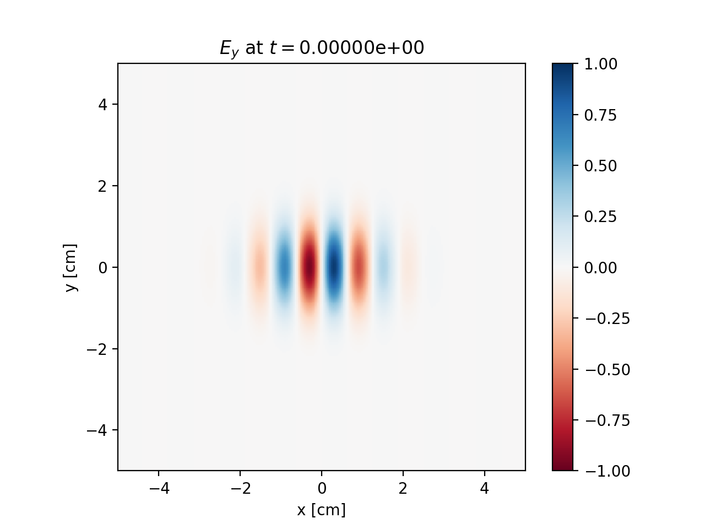
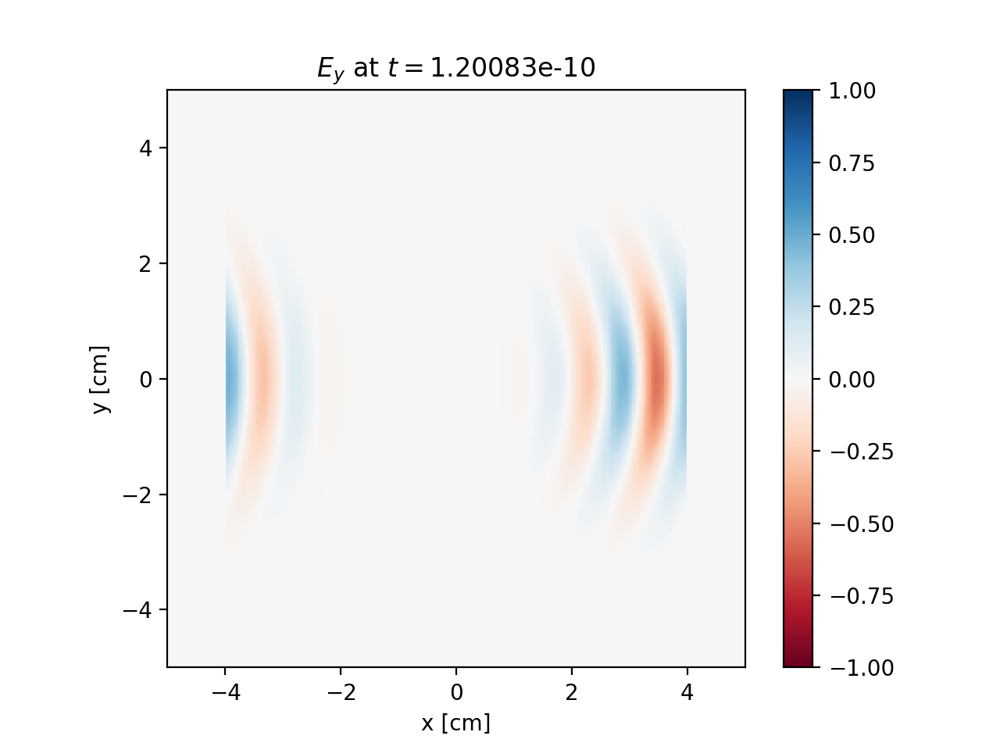
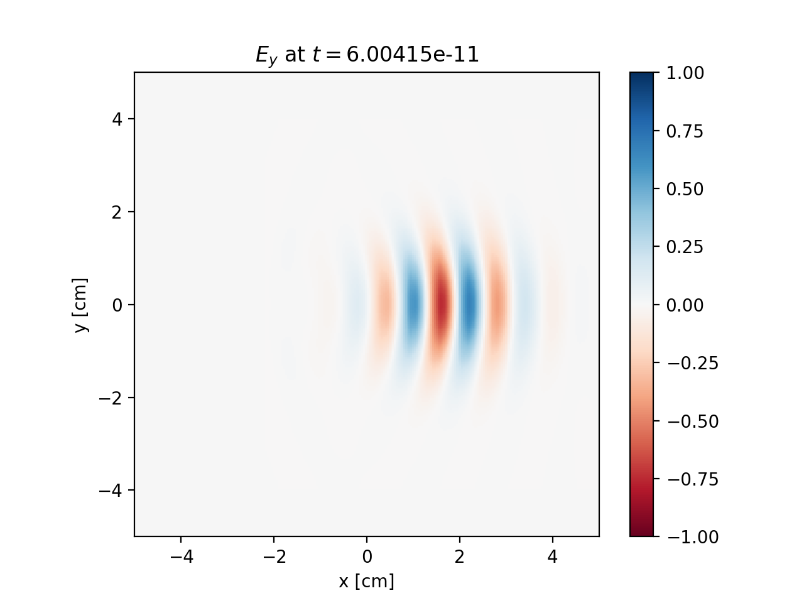
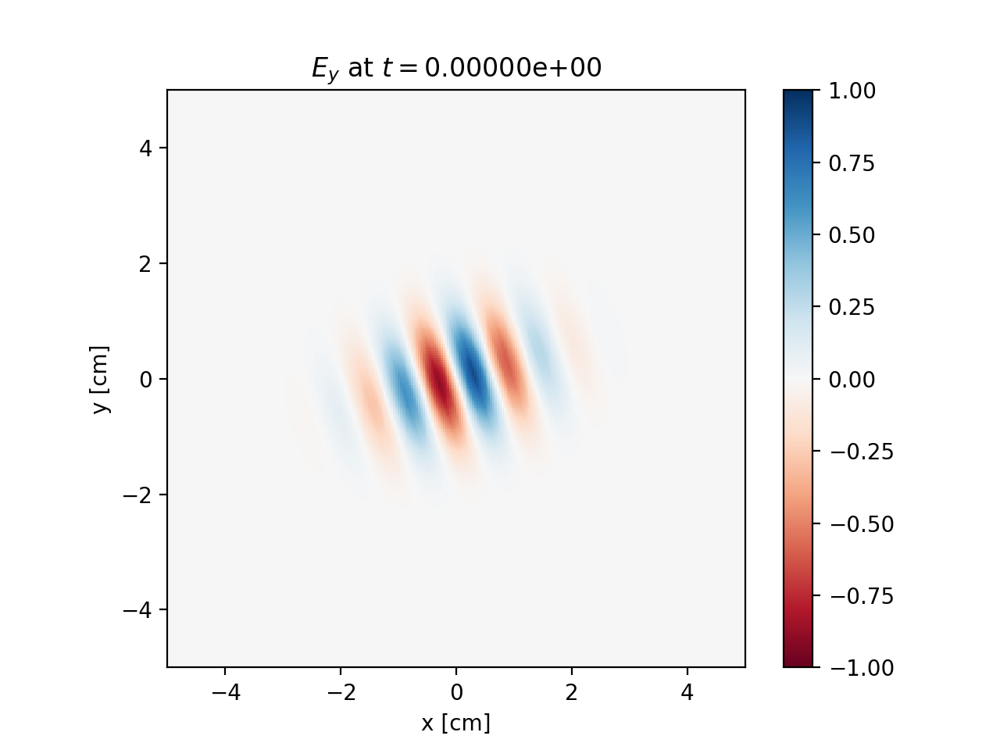
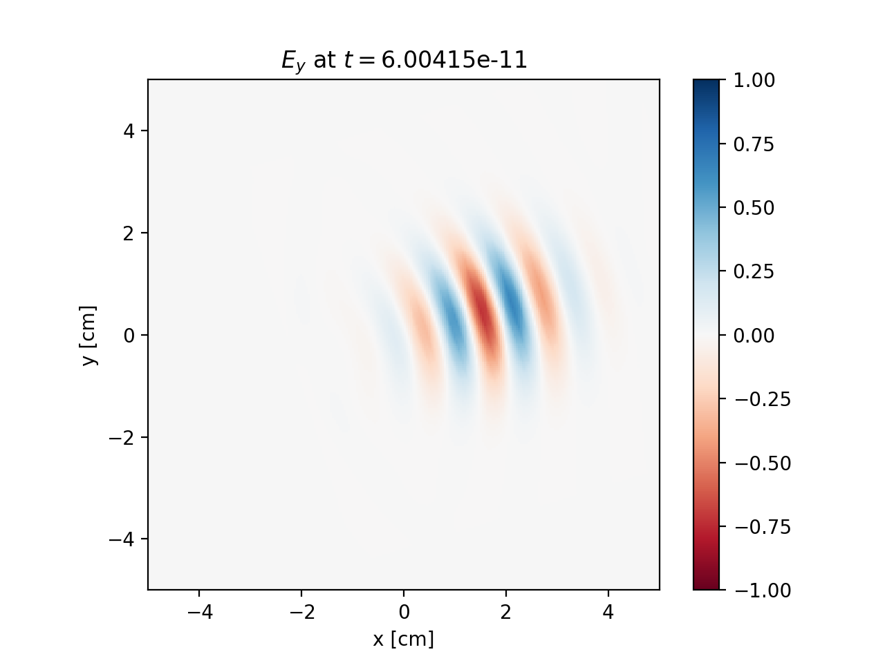
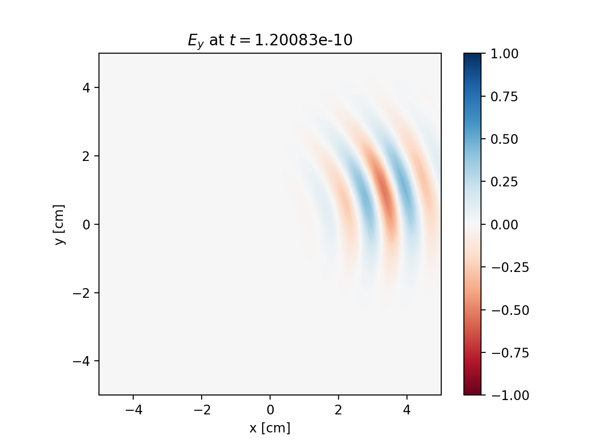

.. |date| date:: September 22, 2021
.. |time| date:: %H:%M

Technical manual
##################################################

|date|

click `here <https://github.com/hi-chi>`_ to go to the project repository on GitHub

Introduction
============
The hi-:math:`\chi` (hi-chi, stands for high-intensity collisions and interactions) is a Python package for performing simulations and data analysis in strong-field particle and plasma physics. The package is designed to serve as a "construction set" for the creation of various numerical setups using a collection of composable elements. The underlying ``C++`` framework of the project facilitates the development of new elements either for individual setups or for enriching the toolbox of the package. In this way, the project is aimed to combine the flexibility on the Python level with the efficiency of resource-intensive computations on the ``C++`` level. Here we describe both the interface on the Python level and the underlying framework on the ``C++`` level.

Primitives
==========
On the ``C++`` level the project operates with a number of basic elements (Python notation is given in parenthesis):

- ``FP`` is a floating point number (either ``double`` or ``float``);
- ``FP3`` (``Vector3d``) is a 3D vector of ``FP`` numbers (x, y, z);
- ``Int3`` is a set of 3 ``int`` numbers.

On the ``Python`` level, apart from basic mathematical elements of ``numpy`` and functions defined with ``numba``, the project operates with the following objects:

#. ``particleType`` is a globally accessible, extendable\* (within a particular project) list of particle types. As default the list includes particle types: ``ELECTRON``, ``POSITRON`` and ``PHOTON``. Each type is characterized by ``name``, ``charge`` and ``mass``. For photons we assume ``mass = 0``, which indicates that the photon is treated as a particle moving with the speed of light.

#. ``particle`` is a data object for particles that has attributes:

   - ``Vector3d r`` (coordinate)
   - ``Vector3d p`` (momentum)
   - ``weight`` (associated number of real particles)
   - ``particleType``

and can be created, modified and supplemented as a parameter, e.g.:

.. code:: python

  import hichi as hc
  import numpy as np
  testParticle = hc.particle(type = hc.ELECTRON,\
                             momentum = Vector3d(0, 0, 0))
  testParticle.set_position(Vector3d(0, 0, 0))
  testParticle.set_weight(100)
  print(testParticle.get_position().x)

Note that particle attributes are accessible only via functions, not directly. This is to allow for an advanced processing and allocation of data, as well as to control the transformation of units (will be later supported). By default all variables are in CGS units.

Data elements
=============

Field
-----

``Field`` is the main entity for the electromagnetic fields in the hi-:math:`\chi` environment.

On the ``Python`` level fields are created out of different types of `field solvers`, which can have individual properties and intrinsic tools. For example, the analyticalField is generated based on given functions. A range of grid solvers are created by setting the grid and its physical boundaries. Grid solvers may also be equipped with specific absorbing boundary conditions. However, one can also apply such conditions directly to the field instance using generic (perhaps less efficient) absorbers.

For example the fields can be created as follows:

.. code:: python

  pulse1_form = hc.analyticalField(ex,ey,ez,bx,by,bz,time_step=0.1)
  pulse1_form.set_time(0)
  pulse2_grid = hc.FDTD(  grid=vector3d(64, 64, 64), \
                        min_coords=vector3d(-3.2, -3.2 -3.2), \
                        space_steps = vector3d(0.1, 0.1, 0.1), \
                        time_step = 0.01/hc.LIGHT_VELOCITY)
  %pulse2_grid.setPml(...) % prototype
  pulse2_grid.set(valueEx,valueEy,valueEz,valueBx,valueBy,valueBz)

  pulse_gaussian=hc.gaussian_beam(width=0.1, ..., time_step=0.1)

Here ``ex``, ``ey``, ``ez``, ``bx``, ``by``, ``bz`` are analytical functions (``numba Jit``) of :math:`(x, y, z, t)`; ``valueEx``, ``valueEy``, ``valueEz``, ``valueBx``, ``valueBy``, ``valueBz`` are analytical functions (either ``Python`` or ``numba Jit``) of :math:`(x, y, z)`.

The created fields can be composed with a sequence of following operations:

* summed (e.g. ``field = pulse1 + pulse2``);
* transformed (e.g. ``field = T(pulse2)`` with earlier defined transform ``T`` which can be a rotation, shift, moving window, etc. (see :ref:`transforms`));
* set to be modified by global handlers (see :ref:`globalHandlers`);
* called with an action (e.g. ``pulse2.interpolateFrom(pulse1)``).

On the ``C++`` level the ``field`` is provided as a wrapper class ``pyField`` that translates the methods of and is generated from a given ``field solver``. Each `field solver` is implemented as a child class that must provide the following methods:

.. code:: c

  void getFields(FP3 const position, FP3 &E, FP3 &B);

interpolates (or computes) electric and magnetic fields to a given ``position``, return zero fields if the position is outside the available physical ranges.

.. code:: c

  void advance();

advances the field over the ``timeStep``.

.. code:: c

  fieldIterator* getIterator() = 0;

returns an iterator that provides a loop over all grid nodes:

.. code:: c

  struct fieldIterator
  {
      void begin();
      bool next();
      FP* Ex(FP3 &position);
      FP* Ey(FP3 &position);
      FP* Ez(FP3 &position);
      FP* Bx(FP3 &position);
      FP* By(FP3 &position);
      FP* Bz(FP3 &position);
  };

The iterator hides the arrangement of a loop over all possible states of a three dimensional index. For each state of the index we can get the pointer to any component and obtain the position, where it is defined:

.. code:: c

  FP3 position;
  for(iterator.begin(); !iterator.next();)
  {
  iterator.Ex(position) = sin(position.x/wavelength);
  iterator.By(position) = sin(position.x/wavelength);
  }

The iterator is unavailable for analytical fields.

The ``pyField`` class translates the iterator to a wrapper ``pyFieldIterator`` that accounts for the applied transforms. The instances of ``pyField`` also translate ``get()`` and ``advance()`` according to applied transformations and actions respectively. Note, however, that running loops over field values can be slow in ``Python``. This can be used for complex diagnostics and debugging, while the resource-intensive routines should be organized via ``hc.task`` (see :ref:`tasks`).

.. _ensemble:

Ensemble
--------

``Ensemble`` is a storage and controller for processing particles. The dedicated implementations are develop to tailor data allocation to a specific field solver. The use of such intrinsically optimized ensembles can provide a significant speed up relative to the use of generic option.

On the ``Python`` level the ensemble can be requested from a specific ``field``:

.. code:: python

  grid = hc.FDTD(grid, minCoords, maxCoords)
  pulse = grid.init(0, 1e-15)
  ensemble = pulse.getIntrinsicEnsemble()

Some field solvers, such as ``analyticalField``, may not support an intrinsic implementation of ensemble and then a generic ensemble can be used:

.. code:: python

  ensemble = hc.getGenericEnsemble()

Getting an ensemble of a composed field leads to an automatic accounting for all the transformations so that particles are allocated and advanced using the intrinsic system of coordinates, while the transformations are applied accordingly to wrap all the interfaces, such as ``add()`` and ``next()`` (see below). If the field composition involves summation, the first entity will be asked to provide the intrinsic ensemble by convention.

The function ``add()`` can be used to add a particle:

.. code:: python

  testParticle = hc.particle(type = 'electron',
                 position = np.array([0, 0, 0]),
                 momentum = np.array([0, 0, 0]))
  ensemble.add(testParticle)

or an array of particles:

.. code:: python

  for i in range(100):
    global testParticle
    testParticle.setPosition(np.array([i*1e-5,0, 0]))
    ensemble.add(testParticle)

Note that calling ``add()`` allocates data and copies the values of the supplied particle (not sets the pointer to this particle).

The ensemble can be also used as an iterator

.. code:: python

  ensemble.begin()
  while (ensemble.next(testParticle)):
    print(testParticle.position().x, '\n')

Note that here ``testParticle`` is a pointer to the iterated element of ensemble.

On the ``C++`` level the implementation of an ensemble is an optional supplement for each field solver. The implementation must provide the following interfaces:

.. code:: c

  struct ensemble
  {
  virtual void begin() = 0;
  virtual bool next(particle* processedParticle) = 0;
  virtual void remove() = 0;
  virtual void add(particle& newParticle) = 0;
  };

The loop over allocated particles is intended to be arranged via calling ``begin()`` and ``next()`` in the same way as for `fieldIterator`. Calling ``remove()`` sets the flag that the currently processed particle will be removed from the ensemble at the instance of next call of ``next()``. Apart from this, when calling ``next()``, the processed particle can be relocated according to the new position. Calling ``add()`` adds the given particle to the ensemble. Note that newly added particles do not participate in the ongoing loop by convention.

Modules
=======
Apart from the above-mentioned objects, the hi-:math:`\chi` framework is designed to be extendable by specialized tools that are referred to as `modules`. Here we described specially designed classes for modules.

.. _transforms:

Transforms
----------
Transform is a type of modules that handles the transformation between different reference systems or representations. On the ``Python`` level transforms are created and then applied as follows:

.. code:: python

  Rz = hc.rotateZ(0.3)
  pulse = Rz(pulse1)

Note that the transformed instance remain available with non-transformed coordinates. Transforms can also be used to arrange techniques like the moving window method:

.. code:: python

  MovingWindow = movingWindowX(minCoords.x, maxCoords.x, pulse1)
  pulse = MovingWindow(pulse1)

On the ``C++`` level a transform can be created as a child of base structure:

.. code:: c

  struct transform_
  {
  virtual pyField operator()(pyField& field) = 0;
  virtual void directCoords(FP3& vect) = 0;
  virtual bool inverseCoords(FP3& vect) = 0;
  virtual void directField(FP3& vect) = 0;
  virtual void inverseField(FP3& vect) = 0;
  };

In future versions, the framework is intended to support optional transforms for pseudoVectors, spinors, tensors, pseudoTensors, etc.

Particle handlers
-----------------
Particle handlers are methods for advancing a particle state in a given field. On the ``Python`` level particle handlers can be multiplied to compose the process of handling particles with a sequence of operations in the given order, e.g.:

.. code:: python

  particlePush = hc.move*hc.boris*hc.classicalRR_LL

The handlers can have a form that requires setting parameters:

.. code:: python

  iN = hc.ionizationADK(ions = ['N5','N6', 'N7'],
              ionizationPotential_eV = [97.9, 552, 667],
              Z_number = [5, 6, 7],
              l_number = [1, 0, 0],
              m_number = [0, 0, 0])
  particlePush = hc.move*hc.Boris*iN

On the ``C++`` level each particle handler is develop as a child class of

.. code:: c

  struct particleHandler
  {
  virtual void setTimeStep() = 0;
  virtual void act(particle& Particle, const FP3 E, const FP3 B) = 0;
  };

The method ``setTimeStep()`` provides an opportunity to perform needed preparation calculations, whereas ``act()`` is for performing the intended operations with the given particle. The base class of handlers is equipped with methods for removing currently processed particle and adding new particles:

.. code:: c

  void remove();
  void add(particle& newParticle);

The examples of particle handlers include:

- ``move`` moves the particle according to its speed.
- ``boris`` makes the standard Boris push, but does not change the coordinates. By convention if the particle's mass = 0, we treat it as a photon and do nothing.
- ``classicalRR_LL`` amends the momentum according to the Landau-Lifshitz form of radiation reaction (RR).
- ``comptonScattering_probabilisticRecoil_LCCFA`` amends the momentum probabilistically according to the QED rate under the locally constant crossed-field approximation (LCCFA).
- ``comptonScattering_regularizedRecoil_LCCFA`` amends the momentum regularly according to the QED rate under the locally constant crossed-field approximation (LCCFA).
- ``QED_AEG(parameters...)`` accounts for SFQED processes using advanced event generator (see \cite{gonoskov.pre.2015}): may remove the processed particle,and create new ones to account probabilistically for the nonlinear Compton scattering and Breit-Wheeler pair production (under LCCFA). Take boris pusher as a parameter to do subcycling.
- ``ionizationADK(parameters...)`` adds particles to account for the ionization according to the Ammosov-Delone-Krainov (ADK) theory.
- ``spinPrecession(basis, parameters...)`` advances the spin state according to the Thomas-Bargmann-Michel-Telegdi equation (requires the inclusion of spin state in the definition of leptons).

.. _globalHandlers:

Global handlers
---------------
Global handler is a type of modules for modifying the state of ensembles and fields. On the ``Python`` level they are introduced to set tasks (see section :ref:`tasks`) but can be also assigned to be called before or after advancing a given field or ensemble:

.. code:: python

  absorbingWall = hc.fiedlDepleter(rateFunc = f)
  pulse.runAfterAdvance(absorbingWall)

A particular type of global generators imply that they are used once, e.g. for setting initial conditions:

.. code:: python

  pulse1.runOnce(interpolateFrom(pulse2))

Under request, they can be embedded in the interface for direct use:

.. code:: python

  pulse1.interpolateFrom(pulse2)

On the ``C++`` level global handlers provide a way for modifying field, ensemble or both. A global handler can be implemented as a child class of the following base class

.. code:: c

  struct globalHandler
  {
  virtual void setTimeStep() = 0;
  virtual void act(ensemble& Ensemble, field& Field) = 0;
  };

The method ``setTimeStep()`` provides an opportunity to perform needed preparation calculations, whereas ``act()`` is for performing the intended operations with the given ensemble and/or field. Note that this provides a very flexible option for incorporating actions into calculations. However, this flexibility comes at the cost of taking care of parallelization of computations. In the easiest case this can be done using

.. code:: c

  #pragma omp parallel for

The developers of more advanced schemes, including the ones for MPI parallelization, are encouraged to consult with the core developers.

The examples of global handlers include:

- resampling, of all possible types;
- source of particle beams (implies continuous particle adding);
- particle absorbers;
- plasma wave absorbers;
- absorbing/generating boundaries (should be primarily developed within the field solver itself)
- field filtering;
- weighting particles and setting currents to form a particle-in-cell cycle.

Diagnostics
-----------
The diagnostics is a type of modules that is dedicated to arrange data outputs. In terms of implementation and usage it is similar to global handler, but signals that the data will not be amended, only read.
On the ``Python`` level the diagnostics can be assigned to act once per iteration (see section :ref:`tasks`) or to extract distribution manually by a direct call:

.. code:: python

  dataEx = np.zeros(shape=(Ny, Nx))
  pulse.runOnce(hc.interpolateTo(minCoords, maxCoords,
                   func = Ex, dataEx))

The examples of global handlers include:

- mapField(min, max, funcX, funcY, funcZ, funcValue, data) iterates over ``np.array`` data :math:`\eta \in \left[min, max\right]` and sets the value funcValue(Ex, Ey, Ez, Bx, By, Bz) computed with the electromagnetic field interpolated in the point (funcX(:math:`\eta`), funcY(:math:`\eta`), funcZ(:math:`\eta`)). Applicable to 1D, 2D and 3D cases.
- weightParticles(min, max, funcCoord, funcWeigth, data) iterates over the ensemble and adds the value calculated with funcWeigth(x, y, z, px, py, pz, weight, type, ID) to the position funcCoord :math:`in \left[min, max\right]`. Applicable to 1D, 2D and 3D cases.

.. _tasks:

Tasks
=====

The task is a dedicated object that is assumed to be configured in Python and executed for either one or several iterations:

.. code:: python

  diagnostics = hc.countEnergyFlux(shape)
  myTask = hs.task(field, ensemble, particleHandler,
           globalHandler, diagnostics)
  for i in range(100):
    myTask.run(1)
    print(diagnostics.value(), '\n')

When the task is executed, all the supplied instances are checked to have the same timeStep and then are advanced according to the supplied particle, and global handlers together with running the supplied item of diagnostics. A task can be also executed on an external supercomputer, but this function is not yet available.

Examples
========

Electromagnetic pulse
---------------------

Here we show a simple example of handling fields within the hi-:math:`\chi` environment.

We start from creating a field out of analytical expressions:

.. code:: python

  import numpy as np
  import hichi as hc
  from hichi_primitives import *
  from hichi_diagnostics import showEyInXYPlane

  #------analytically defined field------
  def fieldValue(x, y, z, t):
    return np.exp(-(sqr(x + hc.lightVelocity*t)/2 + sqr(y) + sqr(z)))\
         *np.sin(5*(x + hc.lightVelocity*t))
  fv = func4ToC(fieldValue)
  pulse = hc.analyticalField(nullFunc4, fv, nullFunc4,\
                 nullFunc4, nullFunc4, fv)
  field1 = pulse.init(0, 1)
  showEyInXYPlane(field1, -5, 5, -5, 5, fileName = 'field1_Ey.png')

Our code generates the image "field1_Ey.png" shown in fig.~\ref{field1a}.

Next we extend our code by arranging a small grid handled by the spectral solver (PSRTD), and interpolate the field from the item of analytically defined field:

.. code:: python

  #---field handled by spectral solver---
  grid = hc.PSRTD(hc.vector3d(-4, -4, -4), hc.vector3d(4, 4, 4),\
          hc.vector3d(64, 64, 64))
  field2 = grid.init(0, 0.3/hc.lightVelocity)
  field2.interpolateFrom(field1)
  showEyInXYPlane(field2, -5, 5, -5, 5, fileName = 'field2_Ey.png')

This code generates the image "field2_Ey.png" shown in fig.~\ref{field1g}.

.. figure:: figures/field2_Ey.png
   :scale: 50 %
   :alt: field1_Ey.png

To show how the field evolves in time we extend our code with the following function:

.. code:: python

  #------------iterate field-------------
  def showEvolution(field, fileName):
    field2.resetTime(0)
    field2.interpolateFrom(field1)
    for j in np.arange(20):
      showEyInXYPlane(field, -5, 5, -5, 5,\
              fileName=fileName + format(j, '03d') + '.png')
      field.advance()

We can now see how the field is evolved:

.. code:: python

  #-------showing field evolution--------
  showEvolution(field2, 'field2_')

The code produces a sequence of frames, two of which we show in fig.~\ref{field2}.

As one can see, the field is disrupted and translated within the limits of the grid (from -4 to 4), as it is prescribed by the default periodic boundary conditions of the field solver.

To simulate the propagation in the unbounded space we can apply a transformation of moving window:

.. code:: python

  #--------using moving window----------
  movingWindow = hc.movingWindowX(-4, 4, field2)
  field3 = movingWindow(field2)
  showEvolution(field3, 'field3_')

Our code now generates a sequence of frames for ``field3``, which is shown in fig.~\ref{field3}.

.. figure:: figures/field3_000.png
   :scale: 50 %
   :alt: field3_000.png

.. figure:: figures/field3_012.png
   :scale: 50 %
   :alt: field3_012.png

One can see that the field indeed propagates outside the initial limit :math:`x = 4`. Finally, we extend our code to show the effect of rotational transformation:

.. code:: python

  #----------using rotation------------
  rotateZ = hc.rotateZ(0.3)
  field4 = rotateZ(field3)
  showEvolution(field4, 'field4_')

The code generates a sequence of frames for ``field4``, which is rotated for 0.3 radians about :math:`z` axis. Note that the grid now propagates together with the pulse in the corresponding direction.

To show how the objects of hi-:math:`\chi` are handled we quote the code of the used diagnostic element, which is described among others in ``hichi_diagnostics.py``:

.. code:: python

  import matplotlib.pyplot as plt

  def showEyInXYPlane(field, minX, maxX, minY, maxY, amplitude = 1,\
            fileName = 'EyInXYPlane.png'):
    Nx = 256
    Ny = 256
    Ey = np.zeros(shape=(Ny, Nx))
    E = hc.vector3d(0, 0, 0)
    B = hc.vector3d(0, 0, 0)
    for x in range(Nx):
      for y in range(Ny):
        R = hc.vector3d(minX + (maxX - minX)*(0.5 + x) / Nx,\
                minY + (maxY - minY)*(0.5 + y) / Ny, 0)
        field.get(R, E, B)
        Ey[Ny - 1 - y, x] = E.y / amplitude
    fig, ax = plt.subplots()
    ax.set_title('$E_y$ at $t = ${:.5e}'.format(field.getTime()))
    ax.set_aspect(1.0)
    ax.set_xlabel('x [cm]')
    ax.set_ylabel('y [cm]')
    im = ax.imshow(Ey, cmap='RdBu', interpolation='none',\
             extent=(minX, maxX, minY, maxY), vmax=1, vmin=-1)
    plt.colorbar(im)
    plt.savefig(fileName, dpi=200)
    plt.close()

Particle in a given field
-------------------------

TBA

Usage policy
============

The project follows the following policies:

- **Naming**: To facilitate readability of codes the users are recommended to follow common practice of naming throughout both Python and C++ developments. A short (1-3 words), self-explanatory sequence of words should be used to form the name of a variable, a method or a module. For C++ the words should start with capital letters, except the first word, which should start from lowercase letter. The prefix "_" can be used to indicate units (see below) and/or a specific instance (should be clarified in the comment at the first appearance of the variable). For Python we encourage using the standard convention of starting all words in the name with lowercase letters and separating the words with underscore "_".

- **Units**: CGS units are used by default unless other units are specified explicitly in the name of the variable, e.g. "duration_fs" stands for the variable in femtoseconds. The prefix "_" in the end is reserved to indicate that a variable is in dimensionless units (the dimensionless units should be specified in the comment at the first appearance of the variable).

- **Contributing**: Everyone is welcome to contribute to the project. If a specialized module has been developed for a particular research project, the developers of such a module are encouraged to make it available to other users and also publish the description and validation of their module to be cited by other users.

- **Responsibility**: The project is developed under the MIT License. The correctness of any obtained results is under the responsibility of users. All the utilized computational elements and the appropriateness of their use must be validated by the users to the extent that they consider reasonable. This can be done based on the open-source codes and related publications.

- **Citing**: The users are encouraged to cite the project and the dedicated papers about all the computational components that has been used during the preparation of their manuscript. This is both to acknowledge the contribution of developers of used modules and to facilitate the results understanding, reproduction and validation by the readers.
